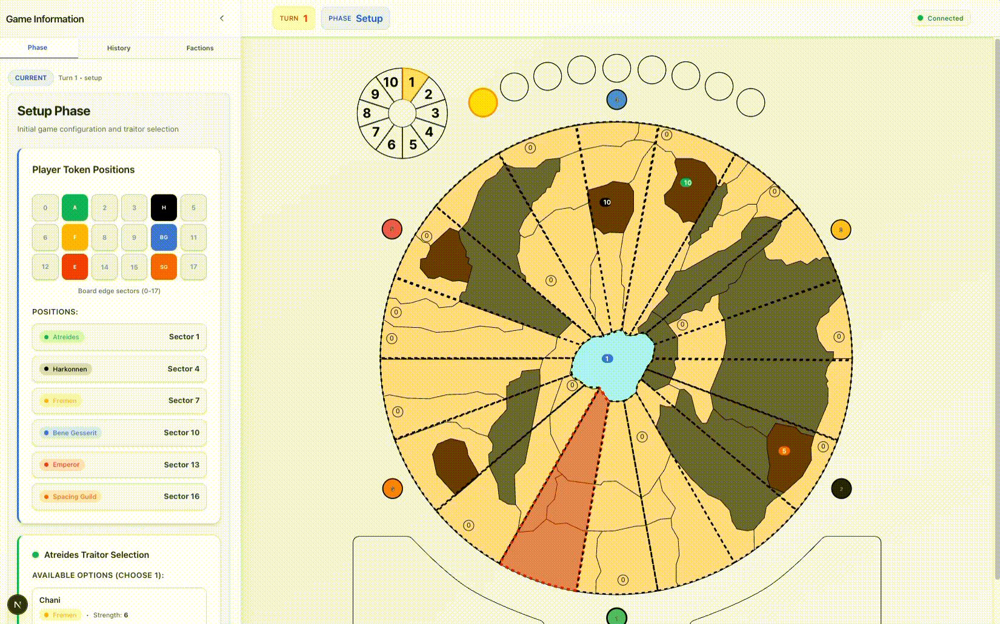

# Dune Bench

A full game engine and AI benchmarking platform for **Dune (GF9)** -- the Gale Force Nine board game. LLM agents control factions, play full games, and get benchmarked on rule compliance and decision quality.



## What is this?

Dune Bench implements the complete Dune (2019) board game as a turn-based engine with 10 phases, 6 factions, and all the treachery, alliances, and sandworms you'd expect. AI agents (via Azure OpenAI / Anthropic) play as factions using tool-calling -- shipping forces, bidding on treachery cards, engaging in battle, collecting spice, and more.

The project started as an exploration of how well LLMs can play complex strategy board games with intricate rules, and evolved into a full rule-coverage tracking system.

## Stats

| Metric | Count |
|--------|-------|
| TypeScript source files | 903 |
| Lines of game engine code | ~163k |
| Total lines of code | ~184k |
| Lines of rules documentation | ~20k |
| Game rules tracked | 336 |
| Rules with `@rule` annotations | 205 |
| Rules with `@rule-test` annotations | 235 |
| Rules excluded (meta/physical/social) | 106 |
| Phase test scenarios | 250 files |
| Rule test files | 148 |
| CSA jobs executed | 75 |

## Game Phases

Setup, Storm, Spice Blow, CHOAM Charity, Bidding, Revival, Shipment & Movement, Battle, Spice Collection, Mentat Pause

## Architecture

```
Next.js UI  -->  SSE Stream  -->  Game Runner
                                      |
                     Phase Manager + Agent Provider (LLM)
                                      |
              Phase Handlers (10 phases, each with state mutations)
                                      |
                          Game State + @rule annotations
```

## The Interesting Part: Rule Coverage with `@rule` Labels and Cursor Sub Agents

The most interesting aspect of this project was building a **rule-coverage tracking system** combined with a **custom Cursor Sub Agents CLI** to systematically label every game rule in the codebase.

### How it works

1. **336 numbered rules** are extracted from `numbered_rules/*.md` into a rules index
2. Source code is annotated with **`@rule`** (implementation) and **`@rule-test`** (test) labels
3. A coverage CLI scans all annotations and computes coverage against the full rule set
4. Rules that don't need code (physical setup, social interactions) are tracked in `rule-exclusions.json`

### `@rule` annotations in code

```typescript
// In phase handlers:
// @rule 1.08.02
// Check if faction has ornithopter access (forces in Arrakeen or Carthag)

/**
 * @rule 1.06.03.03 SECTORS: When shipping into a Territory lying in several
 * Sectors, a player must make clear in which Sector they choose to leave Forces.
 */
```

```typescript
// In test files:
/**
 * @rule-test 1.02.05
 * Sandworm never devours newly placed spice
 */
```

### Rule coverage CLI

```bash
# Implementation coverage report
pnpm rule-coverage

# Visual dot matrix of all rules
pnpm rule-coverage:visual

# Test coverage report
pnpm rule-test-coverage

# Find rules that still need implementation
pnpm rules:missing

# Check status of a specific rule
pnpm get-rule-status -- 1.06.01

# Rules that are implemented but need tests
pnpm rule-needs-tests

# See all excluded rules and their reasons
pnpm rules:excluded
```

Example output of `pnpm rule-coverage:visual`:

```
📊 Rule Implementation Status (Visual)

Legend: ✓ = Implemented & Tested  · = Not implemented  X = Excluded (no impl needed)  x = Excluded (needs impl)

Setup (0.*) - 5/5 implemented (100.0%), 12 excluded
────────────────────────────────────────────────────────────────────────────────
  XXXXXXXXXX✓✓✓XX✓✓
  Summary: 5 ✓, 12 X

Phases (1.*) - 99/108 implemented (91.7%), 59 excluded
────────────────────────────────────────────────────────────────────────────────
  XXXXxXX✓x✓✓X✓✓✓✓✓✓X✓✓X✓✓✓✓✓✓X✓✓✓X✓✓✓·X·X✓·✓✓✓X✓✓✓xXX✓✓✓X✓✓✓✓✓✓✓X✓✓✓✓✓✓✓✓✓✓✓✓
  X····✓✓✓·✓✓✓✓✓✓✓✓✓✓✓✓✓✓✓✓✓✓✓X·✓✓X✓✓X✓✓✓Xx✓XX✓✓✓✓✓✓X✓✓XX✓x✓XXXxxxxxxxXx✓XXXx✓
  X✓X✓✓✓xxxxxxx✓x
  Summary: 99 ✓, 9 ·, 22 x, 37 X

Factions (2.*) - 93/93 implemented (100.0%), 24 excluded
────────────────────────────────────────────────────────────────────────────────
  Xx✓✓X✓✓Xx✓✓✓x✓✓✓✓XX✓✓x✓✓✓✓x✓X✓✓✓✓✓✓✓✓✓✓✓✓Xx✓✓✓✓Xx✓✓✓✓✓xX✓✓✓✓✓✓✓✓✓✓✓✓✓✓✓✓xx✓✓
  ✓✓✓✓Xx✓✓✓✓✓X✓✓✓✓✓✓✓✓✓✓x✓✓✓✓✓X✓✓✓✓✓✓✓✓✓✓✓✓
  Summary: 93 ✓, 12 x, 12 X

Treachery Cards (3.*) - 24/24 implemented (100.0%), 11 excluded
────────────────────────────────────────────────────────────────────────────────
  XX✓✓✓✓✓✓✓✓x✓XX✓✓✓✓x✓✓✓✓✓✓✓✓✓✓x✓XXxX
  Summary: 24 ✓, 4 x, 7 X

════════════════════════════════════════════════════════════════════════════════
Overall: 336 rules (230 tracked, 106 excluded)
  ✓ Complete: 221 (96.1%)  · Missing: 9 (3.9%)
  x Excluded (needs impl): 38  X Excluded (no impl needed): 68
```

### Cursor Sub Agents CLI (CSA)

The heavy lifting of labeling 336 rules was done using a **custom-built CLI for running Cursor sub agents**. Jobs are defined in `.csa/jobs/` as JSON files:

```json
{
  "id": "label-rules-section-1.04",
  "goal": "Label or exclude all rules in Section 1.04 (Bidding Phase).",
  "tasks": [{
    "name": "Process Section 1.04 Bidding Phase rules",
    "type": "tag-or-exclude-rule",
    "files": ["numbered_rules/1.md", "src/lib/game/rules/index/rule-exclusions.json"],
    "prompt": "Process all rules in Section 1.04. For each rule: get unlabeled rules, then either tag fully implemented rules with @rule annotations or exclude incomplete/missing rules."
  }]
}
```

Task types in `.csa/task-types.json` define reusable command sequences. The `tag-or-exclude-rule` type runs two steps per rule:

1. **`get-next-rule-in-section`** -- finds the next unlabeled rule
2. **`label-or-exclude-rule`** -- adds `@rule` annotation or excludes it

75 CSA jobs were executed across all rule sections, systematically processing every rule in the game -- labeling implementations, writing tests, and excluding rules that don't apply to a digital implementation.

## Running

```bash
pnpm install
pnpm dev          # Web UI at localhost:3000
pnpm benchmark    # Run LLM benchmark games
pnpm test         # Run all rule tests
```

## Tech Stack

Next.js 16, React 19, TypeScript, Vercel AI SDK, Azure OpenAI, Tailwind CSS, shadcn/ui
